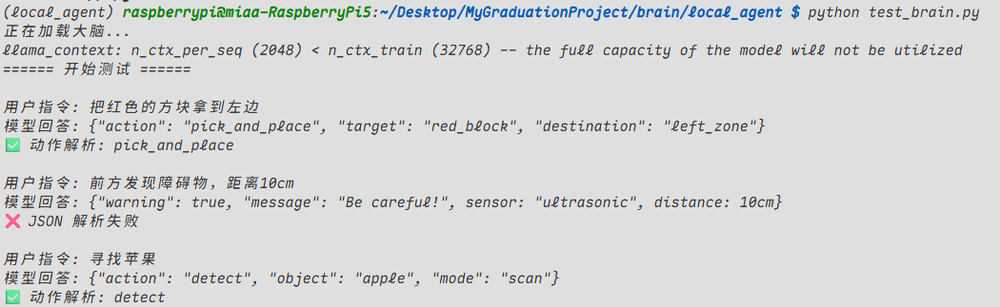

# Local agent

本部分旨在构建一个基于 Python 3.10 和 Unsloth 的高效大模型微调环境。

## 📋 环境要求 / Prerequisites

* **OS**: Linux / MacOS / WSL2
* **Python**: 3.10
* **工具**: [uv](https://github.com/astral-sh/uv) (极速 Python 包管理器)

## 🚀 快速开始 / Quick Start

请严格按照以下顺序执行命令，以确保虚拟环境配置正确。

### 1. 项目初始化
创建并进入工作目录：

```bash
mkdir -p ~/brain/local_agent
cd ~/brain/local_agent
```

### 2.搭建环境
```bash
uv venv --python 3.10
source .venv/bin/activate
```

### 3.安装Unsloth 和 PyTorch
```bash
# 1. 安装 PyTorch (uv 会自动解析依赖)
uv pip install --upgrade pip
uv pip install "unsloth[colab-new] @ git+https://github.com/unslothai/unsloth.git"

# 2. 安装其他依赖
uv pip install --no-deps "trl<0.9.0" peft accelerate bitsandbytes torchvision
```
### 4.训练
```bash
#国外源
python train_robot.py

#国内镜像源
HF_HUB_ENABLE_HF_TRANSFER=0 HF_ENDPOINT=https://hf-mirror.com python train_robot.py

```
### 5.得到模型
qwen2.5-1.5b-instruct.Q4_K_M.gguf

### 6.通过scp将模型传到树莓派端
```bash
scp qwen2.5-1.5b-instruct.Q4_K_M.gguf pi@100.xx.xx.xx:~/
```

### 7.树莓派端需要重新设置环境(这一步是让树莓派拥有运行 GGUF 模型的能力)
```bash
uv pip install llama-cpp-python               
```

### 8.树莓派运行程序
```bash
python test_brain.py
```

## 效果
