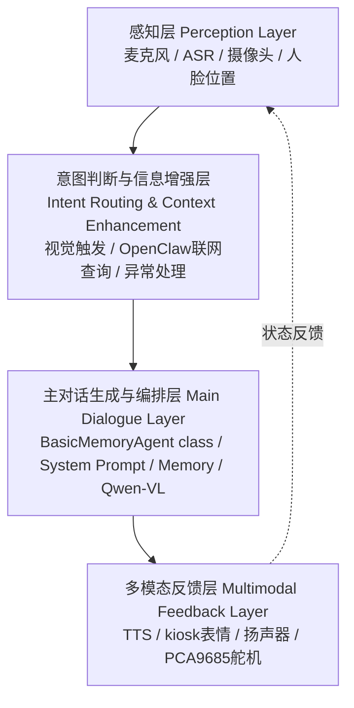
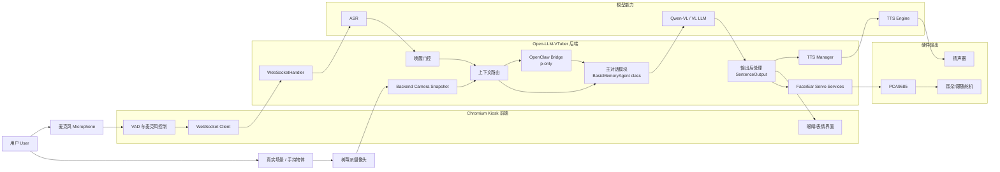
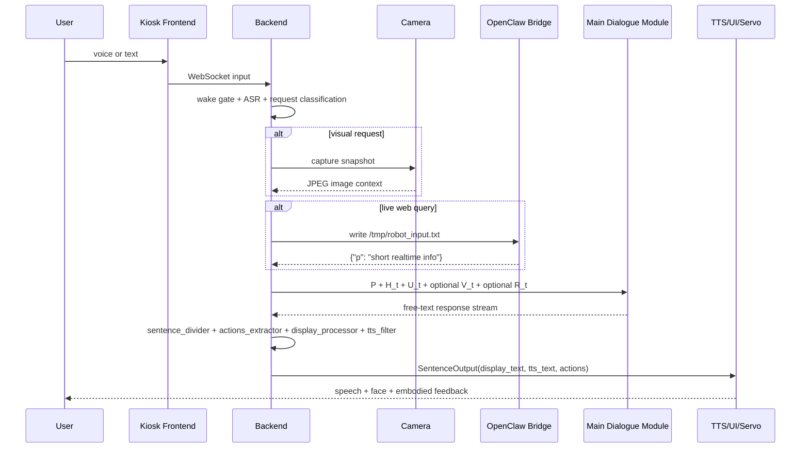
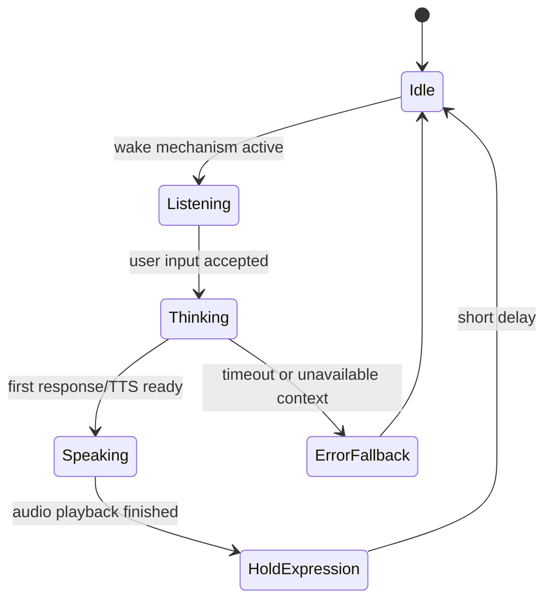

# Public Thesis Materials / 论文公开支撑材料

本文档汇总毕业论文写作和答辩可公开引用的信息。它只公开系统设计、模块边界、交互样例、测试口径和硬件组成，不公开 API Key、私有服务地址、完整 `conf.yaml`、认证文件、聊天历史或包含隐私的运行日志。

This document collects public thesis-supporting information. It publishes design intent, module boundaries, interaction examples, test scope and hardware composition. It does not publish API keys, private service endpoints, the full `conf.yaml`, authentication files, private chat history or sensitive logs.

## 1. Requirement Analysis / 系统需求分析

### Target Users / 目标用户画像

| User group | 中文说明 | Main Needs |
| --- | --- | --- |
| Desktop companion users | 面向宿舍、书桌、实验室等近距离使用场景 | 低门槛语音交互、陪伴感、可见表情反馈 |
| Anime-pet interaction users | 对二次元角色、电子宠物和拟人化交互感兴趣的用户 | 角色一致性、轻量萌宠语气、表情和耳朵动作 |
| Graduation-demo evaluators | 毕设展示、答辩和作品集评审人员 | 可解释架构、稳定演示流程、软硬件协同证据 |
| Embodied-AI learners | 学习多模态对话、树莓派部署和硬件控制的开发者 | 可复现模块边界、可扩展代码结构、安全约束 |

### Typical Scenarios / 典型使用场景

| Scenario | User Goal | System Behavior |
| --- | --- | --- |
| Wake-up chat | 用户靠近设备并开始对话 | 前端采集语音，后端进行唤醒门控和 ASR，主对话模块生成短回复 |
| Visual question | 用户询问“我手里拿的是什么”等视觉问题 | 后端按视觉触发规则采集摄像头快照，并将图像作为可选上下文注入主对话模块 |
| Live information query | 用户询问天气、新闻或需要联网搜索的问题 | OpenClaw bridge 只返回 `p` 信息字段，主对话模块负责最终表达 |
| Emotional response | 用户进行日常闲聊或收到回答 | kiosk 显示对应表情，TTS 播报，耳朵/舵机服务按后端状态触发 |
| Portfolio demo | 展示项目结构和运行链路 | GitHub README、架构文档、公开系统提示词和测试表支撑说明 |

### User Interaction Examples / 用户交互流程示例

| Step | Voice Interaction Example | System Response |
| --- | --- | --- |
| 1 | 用户先说唤醒短语 | 系统进入短时活跃窗口，并用 TTS 简短回应 |
| 2 | 用户问“广州今天的天气怎么样？” | OpenClaw 返回 `{"p": "广州: ⛅ +29°C ... 湿度43%"}`，主对话模块转述为自然中文 |
| 3 | 用户问“你能看到我手里拿着什么吗？” | 后端附加摄像头快照，视觉语言模型结合图像回答 |
| 4 | 用户普通闲聊“你现在状态怎么样？” | 不触发摄像头，也不触发 OpenClaw，主对话模块直接回答 |

### Persona Positioning / 二次元萌宠角色定位

“小灰”被定位为桌面二次元萌宠机器人助手。它不是通用客服，也不是完全拟人的虚拟人，而是一个具有轻量角色感、短句表达、可见表情和简单实体动作反馈的电子宠物。公开系统提示词见 [Public System Prompt](../runtime/system-prompt.md)。

Xiaohui is positioned as a desktop anime-pet robot assistant. It is not a generic customer-service bot or a fully humanlike avatar, but an electronic pet with a lightweight persona, short spoken answers, visible expressions and simple embodied feedback.

### Non-Functional Requirements / 非功能需求

| Requirement | Design Basis | Public Evidence |
| --- | --- | --- |
| Stability | 使用后端摄像头快照、本地 TTS 播放、用户级 systemd 服务 | [Raspberry Pi deployment](../deployment/raspberry-pi.md) |
| Usability | 唤醒门控、短句回复、kiosk 常驻前端 | README 运行链路和本文件交互样例 |
| Responsiveness | 语音、视觉、TTS 分阶段处理；摄像头快照耗时较低 | [性能指标表](系统性能指标记录表4-3.md) |
| Safety | OpenClaw 不控制表情、摄像头和舵机；舵机由后端限幅 | [Dialogue module abstraction](../runtime/agent-abstraction.md) |
| Privacy | 不公开完整配置、日志、认证文件和聊天历史 | 本文档“Non-Public Information” |
| Extensibility | 主对话模块、视觉上下文、联网信息、硬件反馈分层解耦 | 四层架构映射表 |

## 2. Overall Design / 系统总体设计

### Four-Layer Architecture / 四层架构



| Layer | Actual Modules | 中文说明 |
| --- | --- | --- |
| 感知层 | Chromium kiosk microphone, VAD, ASR, backend camera service, face tracking service | 将语音、文本、图像和人脸位置转为可处理输入 |
| 意图判断与信息增强层 | visual trigger detector, OpenClaw bridge, file protocol, timeout handling | 判断是否需要视觉上下文或联网信息 |
| 主对话生成与编排层 | `BasicMemoryAgent` class, system prompt, memory, OpenAI-compatible VL model | 统一融合人设、历史、用户输入和可选上下文，并生成自然语言回复 |
| 多模态反馈层 | TTS manager, local audio playback, expression UI, PCA9685 services | 将文本回复转为语音、表情和实体动作反馈 |

### System Architecture Diagram / 系统整体架构图



### Data Flow / 模块数据流



### Deployment Topology / 本地部署拓扑

```mermaid
flowchart TB
    subgraph RaspberryPi[Raspberry Pi Prototype]
        MainSvc[open-llm-vtuber.service<br/>FastAPI/WebSocket Backend]
        BridgeSvc[openclaw-robot-bridge.service<br/>Live Query Sidecar]
        KioskSvc[kiosk autostart service<br/>Chromium Frontend]
        TmpFiles[/tmp/robot_input.txt<br/>/tmp/robot_output.json<br/>/tmp/robot_brain.lock]
    end

    KioskSvc -->|http://127.0.0.1:12393| MainSvc
    MainSvc -->|file protocol| TmpFiles
    BridgeSvc -->|watch/read/write| TmpFiles
    MainSvc -->|audio + state| KioskSvc
```

## 3. Perception Layer / 感知层设计

### Voice Input / 语音输入

| Item | Public Description |
| --- | --- |
| Wake mechanism | 采用唤醒机制和短时活跃窗口，减少环境语音误触发；论文中可写“唤醒短语”，不必公开具体词表 |
| ASR role | 将前端音频片段转为文本，再交给后端进行意图判断 |
| VAD role | 判断用户语音片段结束，触发 `mic-audio-end` |
| Example | “唤醒短语 + 广州今天的天气怎么样？” → ASR 文本 → OpenClaw 查询 → 主对话模块回复 |

### Camera and Face Tracking / 摄像头与人脸位置感知

| Item | Public Description |
| --- | --- |
| Camera capture | 后端摄像头服务按需采集 JPEG 快照，避免浏览器摄像头权限不稳定 |
| Visual context | 只有视觉相关问题才附加图像输入 |
| Face tracking | OpenCV DNN 检测与跟踪器估计目标水平位置，经过死区、平滑和限幅后驱动舵机 |
| Public figures | [face_tracking_flow.mmd](figures/face_tracking_flow.mmd), [hardware_wiring.mmd](figures/hardware_wiring.mmd) |

人脸位置控制可在论文中抽象为：

```text
e_t = (x_face - x_center) / frame_width
s_t = alpha * e_t + (1 - alpha) * s_(t-1)
if |s_t| < dead_zone: keep current angle
else: angle_delta = clamp(kp * s_t, -max_step, max_step)
```

其中 `dead_zone`、`kp`、`max_step` 和 `control_interval` 是本地硬件调试参数，公开论文可说明原则，不需要公开完整运行配置。

## 4. Intent Routing and Information Enhancement / 意图判断与信息增强层

### Request Classification / 文本请求分类

| Request Type | Trigger Principle | Context Added | Example |
| --- | --- | --- | --- |
| Ordinary dialogue | 不涉及画面、实时联网或硬件控制 | none | “你现在状态怎么样？” |
| Visual request | 明确询问画面、摄像头、图片、屏幕、手中物体或当前可见内容 | backend camera snapshot | “我手里拿着什么？” |
| Live web query | 天气、新闻、最新信息、联网搜索等实时信息请求 | OpenClaw `p` field | “广州今天的天气怎么样？” |
| Feedback state | 对话开始、播报、情绪标签、唤醒回应等状态 | expression / TTS / safe servo state | “谢谢你”后的开心表情 |

### Visual Trigger Rule / 视觉触发原则

视觉触发规则采用保守策略：宁可不向普通问题注入图像，也不让无关画面污染天气、百科或闲聊回答。视觉上下文只作为主对话模块的可选输入，不直接决定最终表情或动作。

### OpenClaw Trigger and Failure Handling / OpenClaw 触发与异常处理

| Case | Handling |
| --- | --- |
| Matched live-query request | 写入 `/tmp/robot_input.txt`，等待 `p` 字段结果 |
| Returned valid JSON | 归一化为 `{"p": "..."}` 并注入主对话模块 |
| Timeout | 跳过联网上下文，主对话模块可按普通问题回答或说明暂时查不到 |
| Invalid JSON | 忽略该次 OpenClaw 输出，避免污染主对话 |
| Busy lock | 本轮跳过 OpenClaw，保证主系统不被阻塞 |

公开示例：

```json
{"p": "广州: ⛅ +29°C (体感+29°C), 风↖4km/h, 湿度43%"}
```

## 5. Main Dialogue Generation / 主对话生成模块

### Context Fusion / 多源上下文融合

论文可将每轮输入抽象为：

```text
X_t = concat(P, H_t, U_t, optional(V_t), optional(R_t))
S_t = DialogueModel(X_t)
O_t = PostProcess(S_t)
```

| Symbol | Meaning |
| --- | --- |
| `P` | 系统提示词与“小灰”角色设定 |
| `H_t` | 主对话历史记忆 |
| `U_t` | 当前用户文本或 ASR 转写 |
| `V_t` | 可选视觉上下文，即摄像头快照 |
| `R_t` | 可选联网实时信息，即 OpenClaw `p` 字段 |
| `X_t` | 输入给主对话模块的融合上下文 |
| `S_t` | 大模型生成的自然语言流，不要求是固定 JSON |
| `O_t` | 后处理结果，即 `SentenceOutput(display_text, tts_text, actions)` |

### Dialogue Module Boundary / 主对话模块边界

| Module | Boundary |
| --- | --- |
| Main dialogue module | 负责最终回复、人设表达、上下文融合和对话连续性；代码实现类为 `BasicMemoryAgent` |
| Vision | 只提供可选图像上下文，不主动控制回复 |
| OpenClaw | 只提供实时信息 `p`，不替代主回复，不控制表情或动作 |
| Hardware services | 只接收后端安全状态，不接受外部网页内容直接命令 |

### Output Post-Processing / 输出后处理流程

系统提示词没有规定 `Y_t` 必须是三元组或 JSON。实际流程是：大模型先输出可朗读的自然语言流，后端再把文本流拆分、清洗并派生为显示、语音和动作字段。

The system prompt does not require `Y_t` to be a tuple or a JSON object. In implementation, the model emits a readable natural-language stream first, and the backend derives display, speech and action fields through post-processing.

```text
LLM free-text stream
  -> sentence_divider
  -> actions_extractor
  -> display_processor
  -> tts_filter
  -> SentenceOutput(display_text, tts_text, actions)
  -> TTSTaskManager
  -> kiosk frontend + TTS audio + safe ear motion
```

| Stage | Input | Output | Role |
| --- | --- | --- | --- |
| LLM chat completion | `X_t` | free-text token stream | 按系统提示词和上下文生成自然语言，不直接控制硬件 |
| `sentence_divider` | token stream | sentence chunks | 将流式 token 切分为适合展示和播报的句子 |
| `actions_extractor` | sentence text | optional `Actions(expressions, emotion_tags)` | 从文本中提取可选情绪标签或表情标记 |
| `display_processor` | sentence text + actions | `DisplayText` | 生成前端可显示文本 |
| `tts_filter` | `DisplayText` | `tts_text` | 移除标签和特殊字符，得到适合 TTS 的文本 |
| `SentenceOutput` | `DisplayText`, `tts_text`, `Actions` | sentence-level runtime output | 作为后端统一输出单元 |
| `TTSTaskManager` | `SentenceOutput` | audio payload + local playback | 生成音频并通过 WebSocket 发送显示文本和动作字段 |
| Ear motion service | `emotion_tags` or backend state | bounded servo motion | 只执行限幅后的安全动作，不接收网页内容直接命令 |

因此论文中应将 `O_t` 写为后端派生结果，而不是大模型直接给出的结构化控制指令。若回复中没有情绪标签，`actions` 可以为空，TTS 仍会播报 `tts_text`，前端使用默认状态或会话状态兜底。

## 6. Multimodal Feedback Layer / 多模态反馈层

### Expression States / 表情状态设计

| State | Trigger | Public Asset |
| --- | --- | --- |
| neutral | 待机或会话结束 | [neutral.png](expression_screenshots/neutral.png) |
| thinking | 收到问题并等待生成 | [thinking.png](expression_screenshots/thinking.png) |
| happy | 正向回复、唤醒确认或愉快情绪 | [happy.png](expression_screenshots/happy.png) |
| sad | 道歉、失败、看不清或低落内容 | [sad.png](expression_screenshots/sad.png) |
| angry | 强烈否定或愤怒情绪标签 | [angry.png](expression_screenshots/angry.png) |
| surprised | 突发、惊讶或视觉发现 | [surprised.png](expression_screenshots/surprised.png) |

### Ear and Servo Motion / 耳朵与舵机动作

| Mode | Design Intent | Safety Constraint |
| --- | --- | --- |
| neutral | 回到安全默认姿态 | 限幅，停止输出时释放 PWM |
| thinking | 对话开始时给出“正在思考”的实体反馈 | 小幅、短周期动作 |
| happy | 唤醒或正向回复时摆动耳朵 | 受最大角度限制 |
| surprise | 视觉发现或惊讶时短时抬起 | 短时保持后回落 |
| sad | 弱动作或低幅度姿态 | 避免持续堵转 |
| angry | 快速但受限的左右动作 | 平滑和限幅避免机械冲击 |

### Synchronization Strategy / 同步策略



同步原则：主对话模块生成自然语言回复；后处理管线派生 `display_text`、`tts_text` 和 `actions`；TTS 负责语音；前端根据状态和情绪标签更新表情；耳朵/舵机只响应后端安全状态，OpenClaw 和网页内容不能直接驱动硬件。

## 7. Hardware System / 硬件系统与装配设计

公开 BOM 见 [hardware/bom.md](../../hardware/bom.md)。成本字段建议在论文中根据个人购买记录填写；GitHub 公开仓库只保留可展示的模块级清单。

| Hardware Part | Function |
| --- | --- |
| Raspberry Pi | 主控、后端服务、kiosk 页面、本地音频播放 |
| Display | 展示眼睛/表情 UI |
| Camera | 采集视觉上下文和人脸位置 |
| USB microphone / sound card | 语音输入和音频输出接口 |
| Speaker | 播放 TTS 回复 |
| PCA9685 | I2C PWM 舵机驱动 |
| Servos | 耳朵动作和面部/底座跟随 |
| External servo power | 为舵机提供独立动力电源 |

供电原则：树莓派逻辑供电与舵机动力供电分离；PCA9685 逻辑侧接树莓派 3.3V；舵机动力侧接外部电源；树莓派、PCA9685 和外部电源必须共地。

## 8. Implementation Evidence / 系统实现公开依据

### Runtime Configuration Categories / 配置类别

| Category | Public Description |
| --- | --- |
| Character config | 角色名、公开系统提示词、头像等 |
| Model config | 模型类型和兼容接口类别，不公开密钥和私有地址 |
| Voice config | ASR、VAD、TTS、本地播放策略 |
| Camera config | 摄像头索引、帧尺寸、快照服务 |
| OpenClaw bridge config | 文件路径、超时、安全模式、是否注入 `p` |
| Hardware config | PCA9685 通道、限幅、死区和平滑参数 |

### Sanitized Runtime Evidence / 脱敏运行证据

```text
open-llm-vtuber.service: active
openclaw-robot-bridge.service: active
kiosk autostart service: active
camera snapshot: JPEG 640x480
OpenClaw bridge output: {"p": "广州: ⛅ +29°C ... 湿度43%"}
```

这些示例只用于说明部署成功和链路可用，不包含密钥、私有路径以外的信息或聊天历史。

## 9. System Test Plan / 系统测试公开表

| Test ID | Test Item | Input | Expected Result | Public Result |
| --- | --- | --- | --- | --- |
| T01 | Service startup | start user services | 后端、桥接、kiosk 均 active | 已记录脱敏状态 |
| T02 | Ordinary dialogue | 普通中文问题 | 不触发摄像头，不触发 OpenClaw | 通过 WebSocket 链路验证 |
| T03 | Wake mechanism | 唤醒短语 | 进入活跃窗口并简短回应 | 可在本地演示 |
| T04 | Visual QA | 当前画面/手持物体问题 | 附加后端摄像头快照并回答 | 设计链路已公开 |
| T05 | Live weather query | “广州今天的天气怎么样？” | OpenClaw 返回 `p`，主对话模块转述 | 已公开 `p` 示例 |
| T06 | Camera endpoint | request backend snapshot | 返回 JPEG 图像 | 脱敏记录为 640x480 |
| T07 | Expression update | happy/sad/thinking 等状态 | 前端表情切换 | 截图已公开 |
| T08 | Servo safety | 对话/情绪触发动作 | 动作受限幅、死区和平滑控制 | 原理公开，实测值本地保留 |
| T09 | Timeout handling | OpenClaw 无结果或超时 | 不阻塞主对话，忽略外部结果 | 设计策略公开 |
| T10 | Long-running stability | kiosk 连续运行 | 服务不崩溃，音频/前端保持可用 | 性能表记录最长 10h |

性能记录见 [表4-3 系统性能指标记录表](系统性能指标记录表4-3.md)。

## 10. Non-Public Information / 不公开信息

以下内容不写入公开仓库，也不建议出现在论文截图中：

- 大模型 API Key、访问地址、账号信息。
- OpenClaw 认证文件、session 文件和本地 workspace。
- 完整 `Open-LLM-VTuber/conf.yaml`。
- 模型服务商的详细私有调用参数。
- 完整运行日志中包含的 token、路径、用户隐私对话。
- 私人聊天历史或记忆文件。
- 暴露家庭网络、设备公网地址、用户名或账号的截图。
